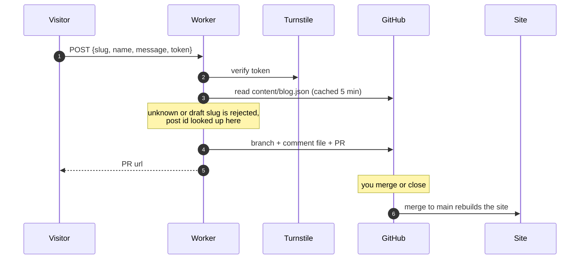

# workers

Not part of the site build. Cloudflare Workers deployed by pasting them into
the dashboard, kept here so they are easy to find. Plain JavaScript, no build
step. Never `wrangler deploy` over them, that overwrites dashboard edits
without warning.

Two separate workers on purpose: the comments one holds a token that can write
to this repo, and that has no business sitting next to the contact form.

## contact-worker.js

Message from `/contact` → Turnstile check → email through Resend.

| Name               | Kind   | Value                                  |
| ------------------ | ------ | -------------------------------------- |
| `TO_EMAIL`         | var    | the inbox, kept out of this file       |
| `TURNSTILE_SECRET` | secret | Turnstile secret key                   |
| `RESEND_API_KEY`   | secret | Resend API key                         |

Set `TO_EMAIL` before pasting this version, or it answers 500 with
`TO_EMAIL env binding missing`.

## comments-worker.js

A comment on a post becomes a PR adding one file. Merge to publish, close to
reject.



### Coupled to this repo

Change these and the worker breaks silently, since nothing here typechecks it:

* posts in `content/blog.json`, each with a permanent `id` (see
  `scripts/ensure-post-ids.ts`) and a `slug`, `draft: true` means unpublished
* comments in `content/comments/<post id>/`, one file each, named to sort by
  date. keyed by id, not slug, so renaming a slug keeps its comments
* dates written `DD-MM-YYYY`, like the posts

### Config

| Name               | Kind   | Value                                                |
| ------------------ | ------ | ---------------------------------------------------- |
| `GITHUB_OWNER`     | var    | `dudustri`                                           |
| `GITHUB_REPO`      | var    | `blog`                                               |
| `GITHUB_BRANCH`    | var    | `main`                                               |
| `ALLOWED_ORIGINS`  | var    | `https://eduardo.dk,http://localhost:3000`           |
| `SITE_URL`         | var    | `https://eduardo.dk`                                 |
| `GITHUB_TOKEN`     | secret | fine grained PAT, `dudustri/blog` only, Contents + Pull requests read and write |
| `TURNSTILE_SECRET` | secret | same secret key as the contact worker                |

The Turnstile site key is per domain, so the contact form's works here too.

Optional: a `RATE_LIMITER` binding (3 per 60s by IP) and a `comment` label. The
worker runs without either.

### API

`POST /` with `{slug, name, message, turnstileToken, website}`. `website` is a
honeypot, hidden with CSS, so anything in it is a bot.

Replies `{success: true, url}` or `{success: false, error}`, where error is one
of `forbidden_origin`, `rate_limited`, `invalid_slug`, `invalid_fields`,
`missing_token`, `failed_verification`, `unknown_post`, `too_many_links`,
`post_missing_id`, `server_error`.

Limits: name 60 chars, message 2000. Control, zero-width and bidi characters
are stripped, a message of only punctuation or emoji is rejected, and more than
two links (or any link in the name) is rejected. The comment goes into the PR
body inside a code fence, so it cannot render as markdown there.

### Stored shape

```json
{
  "id": "a1b2c3d4",
  "postId": "2026-06-13-0878",
  "slug": "ausangate",
  "name": "Someone",
  "message": "Nice trail.",
  "date": "20-09-2026",
  "submitted": "2026-09-20T13:45:01.000Z"
}
```

`id` is the comment's own. `postId` is the link to the post and matches the
directory. `slug` is only there so a stray file is still traceable, it is the
value at the time of writing and is not kept in sync.
